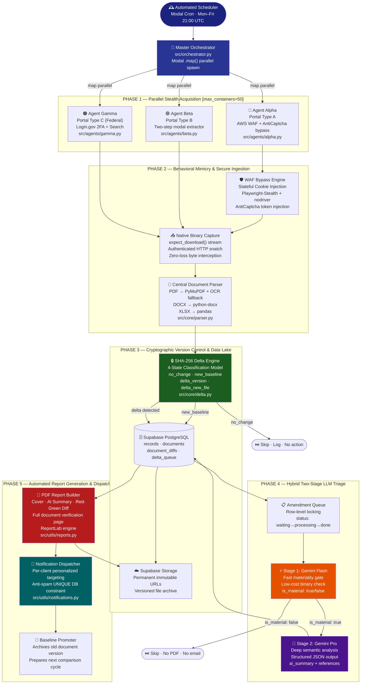
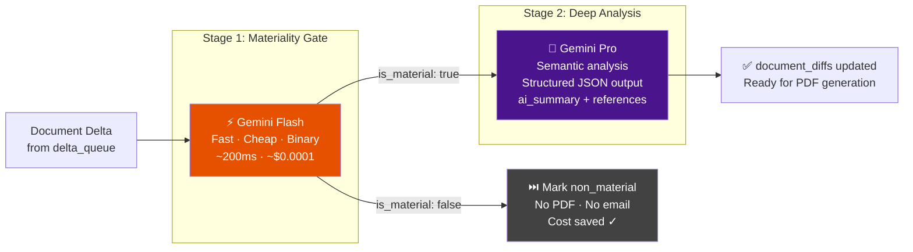
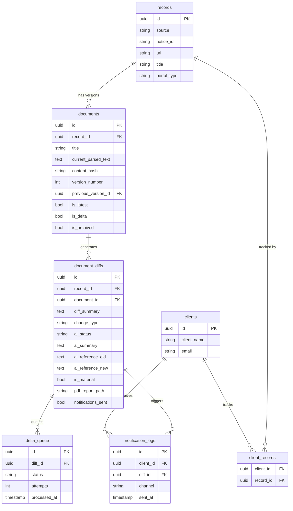

# Enterprise AI Triage Pipeline — BidVeritas Architecture

[](https://python.org)
[](https://modal.com)
[](https://deepmind.google)
[](https://supabase.com)
[](https://playwright.dev)
[]()

> **Note:** This is a sanitized portfolio release. Specific target portal domains, proprietary anti-bot fingerprinting logic, and exact business niches have been intentionally obfuscated to protect intellectual property. All core architecture, algorithms, and data flow remain intact.

---

## What This System Does

This is a fully autonomous, production-grade intelligence pipeline. Its purpose: **watch high-security enterprise portals around the clock, detect when documents change, decide if the change matters, and instantly deliver a professional analysis report — without any human involvement.**

The system runs on a scheduled cron, wakes up serverless containers in parallel, bypasses enterprise-grade Web Application Firewalls (WAFs), downloads complex binary documents (PDF, DOCX, XLSX), detects cryptographic changes, runs a two-stage AI triage, generates a professional PDF evidence report, and dispatches personalized notifications — then shuts down. Zero human intervention. Zero idle cost.

**Real-world impact:** A business that previously paid analysts to manually track procurement portals can replace hours of daily work with this pipeline. Material changes arrive in their inbox as a professional report within minutes of being published.

---

## System Architecture — Complete Pipeline



---

## Project Structure — Explained

```text
/
├── src/
│   ├── agents/
│   │   ├── alpha.py          # Agent for Portal Type A (WAF-hardened, AntiCaptcha)
│   │   ├── beta.py           # Agent for Portal Type B (Two-step modal extraction)
│   │   └── gamma.py          # Agent for Portal Type C (Federal, Login.gov 2FA)
│   │
│   ├── core/
│   │   ├── delta.py          # SHA-256 cryptographic delta detection engine
│   │   ├── triage.py         # Hybrid two-stage LLM triage (Gemini Flash + Pro)
│   │   └── parser.py         # Universal document parser (PDF/DOCX/XLSX + OCR)
│   │
│   ├── utils/
│   │   ├── reports.py        # Professional PDF report builder (ReportLab)
│   │   └── notifications.py  # Notification dispatcher + baseline promoter
│   │
│   └── orchestrator.py       # Master Modal.com control plane
│
├── infra/                    # Cloud infrastructure & deployment configs
├── docs/                     # Architecture blueprints & workflow diagrams
├── .env.example              # Required environment variable template
├── requirements.txt          # Production Python dependencies
└── .gitignore
```

---

## Deep Dive — Every File Explained

### `src/orchestrator.py` — The Master Control Plane

This is the entry point for the entire system. It runs on Modal.com as a scheduled serverless function.

**What it does:**
1. Queries Supabase for all active records grouped by portal type.
2. Uses Modal's `.map()` to spawn **up to 50 parallel containers**, each processing one portal URL independently.
3. Sequences the four pipeline phases: Acquisition → Triage → PDF Generation → Dispatch.
4. Each phase waits for the previous to complete (`.local()` chained calls) to guarantee data integrity.

**Standalone use:** Deploy with `modal deploy src/orchestrator.py`. Trigger manually with `modal run src/orchestrator.py`.

```python
# The core parallel spawn pattern
list(process_single_portal_alpha_task.map(portal_alpha_records))  # 50 containers, simultaneous
```

---

### `src/agents/alpha.py` — Agent Alpha (Portal Type A)

The most complex agent in the system. Targets portals protected by **AWS WAF** with behavioral bot detection, CAPTCHA challenges, and hardened Cloudflare-level firewalls.

**How it works:**
1. Launches a headless Chromium browser via `playwright-stealth` to mask automation fingerprints.
2. Detects AWS WAF CAPTCHA challenges using DOM inspection scripts.
3. Extracts the WAF challenge payload (`websiteKey`, `iv`, `context`) by inspecting `window.gokuProps`.
4. Sends the payload to the **AntiCaptcha API** for human-solved token injection.
5. Injects the solved token into the page via `ChallengeScript.submitCaptcha()` or form submission.
6. Navigates the authenticated session to download documents using `expect_download()` stream interception.
7. Passes all downloaded files to the Central Document Parser.

**Key technical capability:** Maintains a persistent authenticated session across stateless ephemeral cloud containers using cookie injection. The system can bypass enterprise WAF systems that reject standard headless browsers.

**Standalone use:** Can be imported and called per-record:
```python
import asyncio
from src.agents.alpha import run_single_portal_alpha
asyncio.run(run_single_portal_alpha({"id": "record-uuid", "url": "https://...", "notice_id": "ABC123"}))
```

---

### `src/agents/beta.py` — Agent Beta (Portal Type B)

Targets a specific class of public procurement portals that use a **two-step modal download pattern** — where documents are revealed inside a dynamically-loaded popup, not directly linked in the HTML.

**How it works:**
1. Navigates to the record URL and waits for the "View Event Package" trigger button.
2. Clicks the button, which spawns a popup or modal containing document attachment triggers.
3. Scans all open browser tabs/pages for `PV_ATTACH_WRK_SCM_DOWNLOAD` button selectors.
4. For each trigger found: clicks it, waits for the inner `#attachmentWrapperModal`, extracts the authenticated `#downloadButton` href.
5. Executes a **direct authenticated HTTP request** (using the Playwright context's session cookies) to download the actual file bytes — bypassing all flaky browser download events entirely.
6. Falls back to an **"External Snatcher"** mode if no standard attachments are found: scans all page text for contextual external URLs (using keyword-window analysis), then follows them.

**Standalone use:**
```python
import asyncio
from src.agents.beta import orchestrate_single_portal_beta
asyncio.run(orchestrate_single_portal_beta({"id": "record-uuid", "notice_id": "BID-456", "url": "https://..."}))
```

---

### `src/agents/gamma.py` — Agent Gamma (Federal Portal)

Targets federal government procurement portals requiring **Login.gov authentication with TOTP/Backup-Code 2FA**.

**How it works:**
1. Loads a persistent browser `storage_state` (saved session cookies/tokens) from a Modal Volume to skip login on subsequent runs.
2. If session is expired: triggers the full Login.gov flow — enters email/password, detects 2FA prompt, cycles through a local backup code JSON file to authenticate.
3. After authentication: searches the portal by `notice_id`, clicks the result, navigates to the Attachments tab.
4. Downloads each attachment using `expect_download()` native stream interception.
5. Syncs the record title and all documents to Supabase.

**Key design:** The `record_already_has_docs` flag is set **once per record before the file download loop begins** — not inside it. This ensures all files on the first run are correctly classified as `new_baseline`, and all files on subsequent runs are correctly compared as potential `delta_version`.

**Standalone use:**
```python
import asyncio
from src.agents.gamma import orchestrate_single_portal_gamma
asyncio.run(orchestrate_single_portal_gamma({"id": "record-uuid", "notice_id": "W912345"}))
```

---

### `src/core/delta.py` — Cryptographic Delta Detection Engine

The single most critical module in the system. Every downloaded file passes through this engine before anything else happens.

**4-State Classification Model:**

| State | Condition | Action |
|---|---|---|
| `no_change` | SHA-256 hash identical to stored version | Skip. Log. No DB write. No cost. |
| `new_baseline` | Title never seen, record has no prior docs | Save as v1. Mark `is_delta=False`. |
| `delta_version` | Same title, different hash | Save as v2/v3... Mark old as `is_latest=False`. |
| `delta_new_file` | New title, but record already has other docs | Save as v1 for this title. Flag as amendment. |

**Why this matters:** Without this gate, the LLM triage would run on every file every day — even unchanged ones. This cryptographic gate ensures the expensive AI calls happen **only when a real mathematical change is detected**, reducing AI compute costs by ~95%.

**Standalone use:**
```python
from supabase import create_client
from src.core.delta import save_document_with_delta_detection

db = create_client(SUPABASE_URL, SUPABASE_SERVICE_ROLE_KEY)
result = save_document_with_delta_detection(
    supabase_client=db,
    record_id="your-record-uuid",
    title="RFP_Scope_of_Work.pdf",
    content_text="... extracted text ...",
    content_hash="sha256hexstring",
    record_already_has_docs=True  # Set ONCE before any loop, not inside it
)
# result = {"status": "delta_version", "doc_id": "...", "is_delta": True, "version": 3}
```

---

### `src/core/triage.py` — Hybrid Two-Stage LLM Triage Engine

Processes the amendment queue using a two-model strategy designed to maximize accuracy while minimizing cost.

**Two-Stage Strategy:**



**Key features:**
- **Row-level locking:** Sets `status='processing'` before touching a queue item, preventing double-processing across parallel containers.
- **Smart context extraction:** Instead of feeding the entire document to the LLM, a context window is extracted around the specific changed lines — minimizing token consumption.
- **Exponential backoff retry:** 3 attempts with `2^n` second waits on any AI API failure.
- **Structured JSON output:** The LLM is instructed to return `ai_summary`, `reference_old`, and `reference_new` as parseable JSON — not prose.

**Standalone use:**
```python
from src.core.triage import process_queue
process_queue()  # Picks up all 'waiting' items from delta_queue table
```

---

### `src/core/parser.py` — Universal Document Parser

A single `DocumentParser` class that handles all document types with an intelligent OCR fallback.

**Supported formats:**

| Format | Method | OCR Fallback |
|---|---|---|
| `.pdf` | PyMuPDF (`fitz`) | Yes — Tesseract via `pdf2image` if text < 200 chars |
| `.docx` / `.doc` | `python-docx` paragraph extraction | No |
| `.xlsx` / `.xls` | `pandas` + `openpyxl` sheet-by-sheet | No |
| `.csv` | `pandas` read_csv | No |

**Scanned document handling:** If any PDF page has images OR extracted text is below 200 characters, the engine automatically triggers a Tesseract OCR pipeline using `pdf2image` — limited to the first 10 pages to control cost.

**Standalone use:**
```python
from src.core.parser import DocumentParser

text, sha256_hash = DocumentParser.process_file("/path/to/document.pdf")
print(f"Extracted {len(text)} characters | Hash: {sha256_hash[:10]}...")
```

---

### `src/utils/reports.py` — Professional PDF Report Builder

Generates a multi-page professional evidence report for each material document change using the `ReportLab` engine.

**Report structure:**

| Page | Content |
|---|---|
| Cover | Delta type badge, Record name, Document name, Timestamp, Source label |
| Technical Verification | RED highlighted removed/old text, GREEN highlighted added/new text |
| Full Document | Complete new document text for independent human verification |

**Design philosophy:** The report is designed so a non-technical stakeholder can immediately understand what changed and verify the AI's analysis against the raw source document — without needing to open any portals or download files manually.

**Standalone use:**
```python
from src.utils.reports import process_pending_pdfs
process_pending_pdfs()  # Processes all ai_status='completed' diffs
```

---

### `src/utils/notifications.py` — Notification Dispatcher & Baseline Promoter

The final stage of the pipeline. Handles fan-out email delivery and version control promotion.

**What it does:**
1. Finds all `document_diffs` where `ai_status='pdf_ready'` and `is_material=True`.
2. Queries `client_records` junction table to find every client tracking that specific record.
3. For each client: checks `notification_logs` for a `UNIQUE(client_id, diff_id)` constraint — **guaranteeing zero duplicate emails** even if the function crashes and retries.
4. Sends a personalized branded HTML email via Resend API with an embedded link to the PDF report.
5. After all clients notified: calls `promote_baseline()` — archives the old document version (`is_archived=True`) so the next pipeline run compares against the newly-updated document.

**Key design decision — Baseline Promotion:** Without this step, the delta engine would permanently report the same change every day. Promoting the baseline ensures each subsequent run only flags genuinely new changes.

**Standalone use:**
```python
from src.utils.notifications import run_dispatch_cycle
run_dispatch_cycle()  # Dispatches all pending notifications and promotes baselines
```

---

## Database Schema Overview



---

## How to Deploy This System

### 1. Prerequisites

- Python 3.11+
- A [Modal.com](https://modal.com) account (`pip install modal`)
- A [Supabase](https://supabase.com) project with the schema above
- A [Google Cloud](https://console.cloud.google.com) project with Vertex AI enabled
- A [Resend](https://resend.com) account for transactional email
- An [AntiCaptcha](https://anti-captcha.com) account (for Portal Alpha WAF bypass)

### 2. Configure Environment

```bash
cp .env.example .env
# Fill in all values in .env
```

### 3. Install Dependencies

```bash
pip install -r requirements.txt
playwright install chromium
```

### 4. Deploy to Modal

```bash
# Deploy the full scheduled pipeline
modal deploy src/orchestrator.py

# Run a single manual cycle to test
modal run src/orchestrator.py
```

### 5. Run Individual Components (for testing/debugging)

```bash
# Test the triage engine on queued items
python -c "from src.core.triage import process_queue; process_queue()"

# Test the PDF builder
python -c "from src.utils.reports import process_pending_pdfs; process_pending_pdfs()"

# Test notification dispatch
python -c "from src.utils.notifications import run_dispatch_cycle; run_dispatch_cycle()"

# Test document parsing
python -c "from src.core.parser import DocumentParser; print(DocumentParser.process_file('your_file.pdf'))"
```

---

## How to Adapt This for a New Business Use Case

Each module is domain-agnostic. The agents contain the portal-specific logic; the core engines are universal. To target a new portal:

1. **Write a new agent** in `src/agents/` following the same interface:
   - Accepts a `record` dict with `id`, `notice_id`, and `url`
   - Downloads files to a local path
   - Calls `save_document_with_delta_detection()` from `src/core/delta.py`

2. **Add the agent to the orchestrator** in `src/orchestrator.py`:
   - Register it as a `@app.function` 
   - Add a `db.table("records").select(...).eq("portal_type", "your_new_type")` query
   - Map it with `.map()`

3. **No changes needed** to `delta.py`, `triage.py`, `reports.py`, or `notifications.py` — they work on any domain.

---

## Tech Stack

| Layer | Technology | Purpose |
|---|---|---|
| Orchestration | Modal.com Serverless | Scheduled cron, parallel containers, GPU/CPU scaling |
| Browser Automation | Playwright Async + playwright-stealth | WAF bypass, document capture |
| CAPTCHA Solving | AntiCaptcha API | AWS WAF token injection |
| Document Parsing | PyMuPDF, python-docx, pandas | Multi-format text extraction |
| OCR | Tesseract + pdf2image | Scanned document fallback |
| Database | Supabase PostgreSQL | Records, documents, diffs, queue, clients |
| File Storage | Supabase Storage | Immutable versioned document archive |
| AI Triage Stage 1 | Gemini Flash (Vertex AI) | Fast materiality gate |
| AI Triage Stage 2 | Gemini 2.5 Pro (Vertex AI) | Deep semantic analysis |
| PDF Generation | ReportLab | Professional evidence reports |
| Email Delivery | Resend API | Personalized transactional HTML emails |

---

## Security & Operations Philosophy

- **Zero-Leakage:** Every AI call, network request, and DB write has explicit retry logic with exponential backoff. No data is silently dropped.
- **Cost-Optimal by Design:** The SHA-256 cryptographic gate ensures expensive LLM invocations (~$0.01–$0.05 each) only happen when mathematically confirmed changes exist. On a stable portal, this can reduce AI costs by **95%+**.
- **Anti-Spam by Architecture:** The `UNIQUE(client_id, diff_id)` constraint in `notification_logs` prevents duplicate emails at the database level — not just application level. Even if the dispatcher crashes and restarts mid-run, no client receives a duplicate alert.
- **Persistent Statelessness:** Long-lived authenticated browser sessions are persisted to Modal Volumes, surviving cold container restarts. The system can maintain login state across ephemeral infrastructure without human re-authentication.
- **Fail-Safe Progression:** Each pipeline phase (triage, PDF, dispatch) operates independently on database state. If any phase fails, the next pipeline run picks up exactly where it left off without reprocessing completed items.

---

*Architected by Mujeeb Ahmad · AI Systems Engineer · Autonomous Agent Architect*
