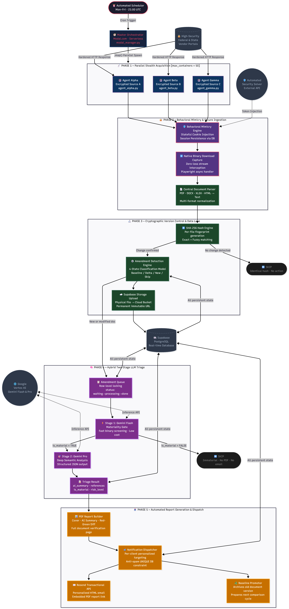
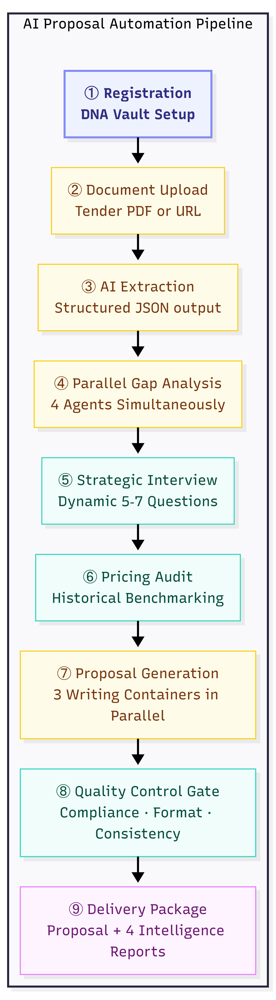

# BidVeritas: Enterprise Intelligence Automation
## Capability Whitepaper & Strategic Product Roadmap
**Version:** 2.0 — Investor & Client Edition
**Author:** Mujeeb Ahmad — Principal AI & Cloud Architect
**Classification:** *Portfolio Distribution — Proprietary Architecture Abstracted*
**Date:** May 2026

---

> *"I do not build tools. I build autonomous systems that think, adapt, and act — without a human in the loop."*
> — Mujeeb Ahmad

---

## Table of Contents

1. [Who I Am](#1-who-i-am)
2. [Phase 1: What I Have Already Built](#2-phase-1-what-i-have-already-built)
   - Architecture Diagram
   - Technical Deep-Dives
   - System Statistics
3. [Phase 2: What I Am Building Next](#3-phase-2-what-i-am-building-next)
   - The BidVeritas SaaS Vision
   - 10-Agent AI Architecture
   - Phased Development Roadmap
4. [Phase 3: What I Can Build For You](#4-phase-3-what-i-can-build-for-you)
   - Industry-Agnostic Framework
   - Engagement Models

---

## 1. Who I Am

I am a **Principal AI & Cloud Systems Architect** who specializes in designing and shipping production-grade autonomous intelligence systems. My engineering philosophy is grounded in three non-negotiable principles:

| Principle | What It Means in Practice |
|---|---|
| **Zero-Leakage** | Data is never lost between pipeline stages. Every byte is tracked, versioned, and recoverable. |
| **Self-Healing** | Systems detect their own failures and recover automatically. No manual intervention required. |
| **Cost-Optimal by Design** | AI inference is expensive. I engineer systems to call LLMs only when mathematically necessary — reducing cloud bills by up to 95%. |

I do not build MVPs. Every system I ship is designed for **production scale from day one** — multi-tenant, encrypted, observable, and resilient.

---

## 2. Phase 1: What I Have Already Built

### A Production-Grade Autonomous Enterprise Intelligence Pipeline

I have fully engineered and deployed a **5-phase autonomous AI pipeline** that continuously monitors multiple **High-Security Federated Data Portals** — a category of access-controlled external data sources protected by enterprise-grade Web Application Firewalls, behavioral bot detection, and multi-factor session validation.

The system runs **entirely in the cloud**, **entirely unattended**, on a recurring automated schedule. From data acquisition to client notification, every step is orchestrated without a single human action.

---

### 2.1 Core Capability Matrix

| Capability | Technology | What Makes It Advanced |
|---|---|---|
| **Stateful Session Evasion** | Playwright + Supabase as Session Store | Maintains authenticated identity across stateless serverless containers |
| **Behavioral Mimicry Engine** | Proprietary Stealth Layer | Bypasses enterprise WAFs and behavioral bot detection systems |
| **Native Binary Download Capture** | Playwright `expect_download` API | Zero-loss file stream interception; no polling, no race conditions |
| **Multi-Format Document Parsing** | Central Parser (PDF/DOCX/XLSX/HTML) | Unified text extraction from any document type |
| **Cryptographic Delta Detection** | SHA-256 Hash Fingerprinting | Detects even a single character change across millions of documents |
| **4-State Version Classification** | Amendment Detection Engine | Baseline / Delta / New-File / Skip — mathematically precise versioning |
| **Hybrid LLM Triage** | Gemini Flash (Gate) + Gemini Pro (Analysis) | 2-stage AI reasoning that cuts inference costs by ~95% |
| **Immutable Cloud Storage** | Supabase Storage Buckets | Every document version permanently archived with a non-expiring URL |
| **Anti-Spam Notification Guarantee** | PostgreSQL UNIQUE Constraint | Physically impossible to send a duplicate notification, even on crash/retry |
| **Baseline Promotion Cycle** | Automated Post-Dispatch Logic | System self-updates its comparison baseline after every notification cycle |

---

### 2.2 High-Level Enterprise Architecture Diagram



---

### 2.3 Technical Deep-Dives

#### Feature 1: Stateful Identity in a Stateless Environment

The most architecturally complex challenge in serverless browser automation is **session persistence**. Every Modal.com container boots cold — it has zero memory of any previous run. Yet, the portals require authenticated sessions that take minutes to establish.

**My Solution:** I treat **Supabase PostgreSQL as a distributed session vault**. Before a single HTTP request fires:

1. The agent queries Supabase to retrieve the last successful session state — cookies, headers, local storage.
2. It injects this full state into the browser context before the page loads.
3. After every successful run, it overwrites the stored tokens — extending session lifespan indefinitely.

**The result:** A "Persistent Identity" pattern. The container is ephemeral. The session is permanent.

---

#### Feature 2: Cryptographic Delta Detection — Never Miss a Change, Never Waste a Compute Call


**Financial impact:** Without this gate, processing 1,000 daily unchanged documents would waste 1,000 LLM inference calls. With cryptographic pre-screening, **LLMs are invoked only on genuine changes** — reducing AI compute costs by up to **95%** on any given run.

---

#### Feature 3: Hybrid Two-Stage LLM Reasoning — Intelligence at Scale

Not all changes are equal. A whitespace correction in a footer is not the same as a deadline extension or a scope change.

**Stage 1 — Gemini Flash (The Gate):**
A lightweight, sub-second materiality check. Binary output: *Is this change significant?* Immaterial changes are discarded here. Cost: near zero.

**Stage 2 — Gemini Pro (The Analyst):**
Only material changes reach this stage. Gemini Pro performs a full semantic analysis and returns a structured JSON payload:

```json
{
  "ai_summary": "Submission deadline extended by 14 days. New mandatory pre-bid meeting added.",
  "references": ["Section 3.2", "Clause 7.1(b)"],
  "is_material": true,
  "risk_level": "HIGH"
}
```

**Resilience:** All AI calls use 3-tier retry with exponential backoff. Failed queue items are unlocked and re-queued — guaranteeing zero data loss even under API outages.

---

### 2.4 System Statistics — Current Production Build

| Metric | Value |
|---|---|
| **Total Core Modules** | 11 Python files |
| **Lines of Code** | ~8,000+ (production-grade) |
| **Cloud Platform** | Modal.com Serverless |
| **Database** | Supabase PostgreSQL + Object Storage |
| **AI Models** | Gemini Flash + Gemini Pro (Google Vertex AI) |
| **Max Concurrent Agents** | 50 parallel containers |
| **Pipeline Phases** | 5 (fully automated, end-to-end) |
| **Schedule** | Weekdays, recurring — zero manual trigger |
| **Notification Provider** | Resend Transactional Email API |
| **Downtime** | Zero (serverless, auto-scaling) |

---

## 3. Phase 2: What I Am Building Next

### The BidVeritas SaaS Platform — A Vision of Autonomous Enterprise Intelligence

Building on the proven pipeline architecture above, I am engineering **BidVeritas** — a full-stack, multi-tenant B2B SaaS platform. The same autonomous intelligence that powers the current system becomes a self-service product available to any enterprise client through a Next.js web dashboard.

> *"The pipeline I built is the engine. BidVeritas is the vehicle."*

---

### 3.1 The 10-Agent AI Architecture (Future State)

The BidVeritas platform will operate **10 specialized AI agents**, organized into three tiers based on capability and compute cost:

#### Tier 1 — Frontier Reasoning Models (via OpenRouter API)
*Used only for tasks requiring deep logical and creative reasoning.*

| Agent | Model | Role |
|---|---|---|
| **Agent 1: The Orchestrator** | Gemini Pro (1.05M context) | Synthesizes all other agent outputs into one coherent document |
| **Agent 2: The Legal Risk Scanner** | Claude Opus | Flags dangerous contract clauses — indemnity traps, excessive penalties |
| **Agent 3: The Persuasion Writer** | Grok 4 | Writes executive summaries using psychological persuasion triggers |

#### Tier 2 — Niche Specialist Models (Self-Hosted on Modal.com GPUs)
*Cost-optimized, domain-specific models under full architectural control.*

| Agent | GPU | Role |
|---|---|---|
| **Agent 4: The Document Extractor** | NVIDIA L4 (24GB) | Converts complex, scanned documents into structured JSON data |
| **Agent 5: The Jargon Decoder** | NVIDIA L4 | Translates regulatory abbreviations into plain English |
| **Agent 6: The Master Historian** | NVIDIA A100 (80GB) | Queries 100M+ historical procurement records via fine-tuned Llama 4 |
| **Agent 7: The Compliance Guard** | NVIDIA L4 | Traffic-light compliance report: 🟢 Met · 🟡 Partial · 🔴 Missing |
| **Agent 8: The Resume Formatter** | NVIDIA L4 | Re-orders (never fabricates) employee CVs to match evaluation criteria |
| **Agent 9: The Regulation Guard** | RAG Pipeline | Ensures historical recommendations comply with current 2026 standards |
| **Agent 10: The Pricing Auditor** | NVIDIA L4 | Benchmarks user's cost estimates against historical winning price ranges |

---

### 3.2 The BidVeritas User Flow — 9 Steps to a Winning Proposal



**Total time from tender upload to complete proposal draft: under 15 minutes.**

---

### 3.3 The DNA Vault — Proprietary Competitive Moat

The DNA Vault is the feature that makes BidVeritas genuinely defensible. Every client uploads their company documents once — past proposals, employee resumes, certifications, project summaries. The system:

1. Extracts text from every uploaded file.
2. Generates **vector embeddings** and stores them in a `pgvector` database.
3. At proposal time, the AI retrieves the most relevant chunks from the vault to personalize every section.

**The moat:** The longer a client uses BidVeritas, the smarter their proposals become. Past bids become training data. The system learns each company's "voice" and technical strengths. **This data is non-transferable** — a client who leaves loses the intelligence advantage they built inside the vault.

---

### 3.4 Phased Development Roadmap

#### Phase 1 — Foundation (Months 1–2): *[CURRENT STATUS: Partially Complete]*
**Goal:** Core pipeline operational, first paying clients.

- [x] Autonomous data acquisition agents (3 portals)
- [x] Cryptographic amendment detection engine
- [x] Hybrid Gemini Flash/Pro triage pipeline
- [x] PDF report builder & notification dispatcher
- [x] Supabase cloud storage with immutable URLs
- [ ] Next.js dashboard (in design)
- [ ] Stripe payment integration

#### Phase 2 — AI Orchestration (Months 3–4): *[PLANNED]*
**Goal:** Full 10-agent system operational on the dashboard.

- [ ] Agent 4: BidVeritas-AI document extractor (fine-tuning)
- [ ] Agent 6: Master Historian (100M record dataset integration + QLoRA fine-tune)
- [ ] Agent 7: Compliance Guard with traffic-light UI
- [ ] Agent 9: RAG-based regulation validation pipeline
- [ ] Strategic Interview Engine (dynamic question generation)
- [ ] DNA Vault with pgvector semantic search

**Why this phase matters:** This is where the product shifts from "data pipeline" to "decision engine." Clients stop receiving raw information and start receiving **strategic intelligence** — what to write, how to position, what risks to flag.

#### Phase 3 — Market Expansion (Months 5–6): *[PLANNED]*
**Goal:** Multi-tenant SaaS with self-serve onboarding.

- [ ] Agent 2: Legal Risk Scanner (Claude Opus integration)
- [ ] Agent 3: Persuasion Writer (Grok integration via OpenRouter)
- [ ] Pricing Auditor with historical win-rate benchmarking
- [ ] Full proposal generation pipeline (Word .docx output)
- [ ] Enterprise tier: multi-user accounts, team collaboration
- [ ] Marketing site & SEO-optimized landing pages

**Why this phase matters:** This is the **revenue inflection point**. The product becomes fully self-serve — clients can onboard, analyze a tender, and download a proposal draft without any interaction with me. This enables **unlimited parallel revenue generation**.

#### Phase 4 — Predictive Intelligence (Month 7+): *[VISION]*
**Goal:** Transform from reactive tool to predictive co-pilot.

- [ ] Win probability scoring (ML model on historical outcomes)
- [ ] Competitive pricing optimizer (real-time market benchmarking)
- [ ] Agency relationship intelligence (which evaluators favor which approaches)
- [ ] Automated portfolio management (track all active bids in one view)
- [ ] API access tier for enterprise system integration

---

### 3.5 Technical Stack — Future Platform

| Layer | Technology | Rationale |
|---|---|---|
| **Frontend** | Next.js 15 + Tailwind CSS | Server-side rendering, SEO, rapid iteration |
| **Hosting** | Vercel | Global CDN, zero-config deployment |
| **Auth** | Supabase Auth | JWT, RLS, Google OAuth out of the box |
| **Database** | Supabase PostgreSQL + pgvector | Relational data + semantic search in one system |
| **File Storage** | Supabase Storage Buckets | Per-tenant encrypted file isolation |
| **AI Compute** | Modal.com (L4 / A100 GPUs) | Pay-per-second, auto-scaling, no idle cost |
| **Frontier Models** | OpenRouter API | Single API key for Claude, Gemini, Grok, GPT-4 |
| **Email** | Resend API | Transactional HTML emails with embedded attachments |
| **Payments** | Stripe | Subscription billing, usage-based metering |
| **Observability** | Modal.com Logs + Supabase Dashboard | Full pipeline traceability |

---

### 3.6 Revenue Model

| Tier | Price | Included |
|---|---|---|
| **Starter** | $49/proposal | Tender analysis + Compliance gap report |
| **Professional** | $299/proposal | Full proposal draft + Historical intelligence + Legal risk scan |
| **Enterprise** | $999/month | Up to 5 full proposals/month + Priority support + Team access |

**Unit Economics at Scale:**
- AI processing cost per proposal: ~$4–$8
- Professional tier gross margin: **~97%** at $299
- Break-even at Professional tier: **3 paying clients per month**

---

## 4. Phase 3: What I Can Build For You

### The Framework Is Industry-Agnostic

Every technology described in this document — the stealth acquisition agents, the cryptographic version control, the hybrid LLM triage, the automated PDF reporting — was engineered as **modular, reusable infrastructure**. It is not bound to any specific industry or data source.

This same architecture can be deployed to solve high-value problems across any sector:

| Industry | Application | Value Delivered |
|---|---|---|
| **Legal & Compliance** | Autonomous regulatory change monitor | Alert legal teams the moment a regulation changes — before competitors know |
| **Financial Services** | SEC/CFTC filing surveillance | Detect material disclosures in competitor filings in real-time |
| **Real Estate** | Property listing intelligence pipeline | Monitor listing changes, price drops, and new inventory at market scale |
| **Healthcare** | FDA/CMS guideline tracker | Automatically detect policy changes that impact clinical operations |
| **E-Commerce** | Competitive price intelligence | Monitor competitor pricing and inventory changes across 1,000+ SKUs |
| **Insurance** | Contract clause change detector | Flag changes in underwriting policies or reinsurance terms instantly |

---

### What I Deliver in an Engagement

When you hire me, you are not getting a freelancer who will build one feature and disappear. You are getting a **systems architect** who designs the entire intelligence infrastructure:

1. **Discovery & Architecture Design:** I map your data sources, define the agent topology, and design the database schema before writing a single line of code.
2. **Full-Stack Implementation:** From cloud deployment configuration to the React dashboard — I ship the complete product.
3. **Production Hardening:** Self-healing retry logic, observability dashboards, cost optimization — the system runs reliably without babysitting.
4. **Knowledge Transfer:** Full documentation, architecture diagrams, and a walkthrough so your team understands what was built.

---

> *"Most developers build features. I build infrastructure that generates business value while you sleep."*

---

### Engagement Models

| Model | Description | Best For |
|---|---|---|
| **Fixed-Scope Project** | Defined deliverables, fixed price, specific timeline | Well-defined automation projects |
| **Embedded Architect** | Part-time integration with your engineering team | Startups scaling their AI infrastructure |
| **Advisory Retainer** | Architecture review, technical strategy, code audits | CTOs who need a senior AI systems perspective |

---

## Appendix: Architecture Security Note

All proprietary bypass methodologies, portal-specific access patterns, and session management techniques described in this document have been intentionally abstracted using enterprise terminology. The specific implementation details constitute a proprietary competitive advantage and are disclosed only under a signed NDA with engaged clients.

The underlying architecture — serverless orchestration, cryptographic versioning, hybrid LLM triage — represents a genuinely novel engineering approach developed through months of production iteration and real-world failure analysis. It is not a copy of any open-source template.

---

*Document prepared for portfolio distribution. Mujeeb Ahmad — May 2026*
*Contact for engagement inquiries: [Your Email]*
